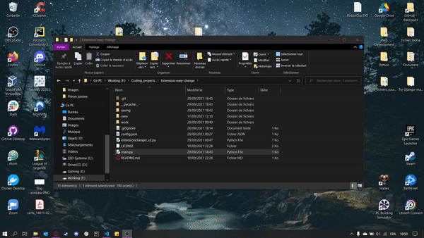
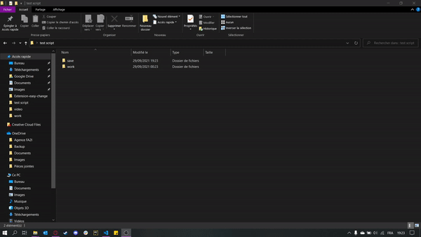

# Extension-easy-change

## How to use  🤔   

 

### Methode 🥇    

 

1. Place the script in the same folder than your 'work' folder where you put your files to modify.
2. Run the main.py script and follow the instructions.
3. All new files will be saved in a folder named 'saving' at the same level as 'work'.  

 

 
 

------

### Methode 🥈 

 

This methode allow to use the script wherever you want to.

1. Place the script wherever.
2. Open the config.json and change the No to Yes if it's not already the case.
3. Indicate in the config.json, the source folder path where are the files to change and the folder where you will save the new generated files.
4. Run the main.py and follow the instruction
5. All new files are in the folder indicated in the config.json

 

